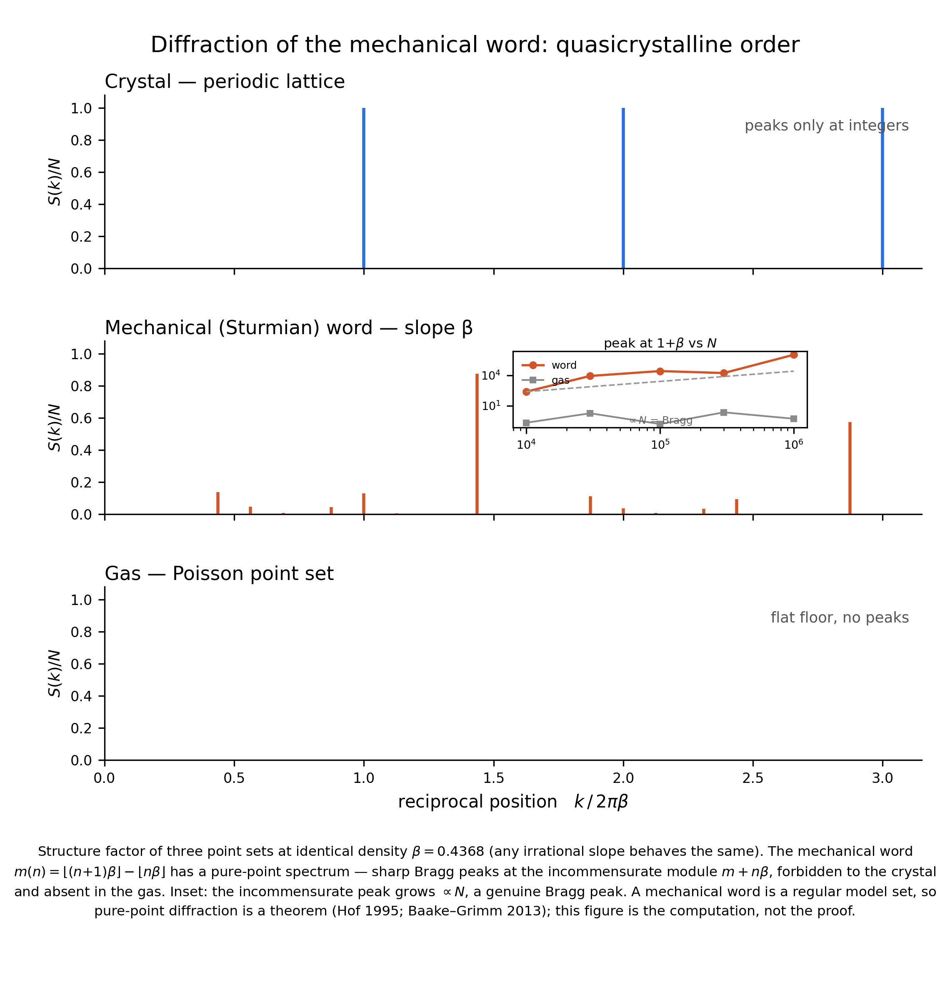

# Diffraction of the mechanical word

A numerical companion to [`MechanicalWord.lean`](../MechanicalWord.lean).
**Nothing in this folder is a kernel theorem** — the Lean modules carry the
formal content; this folder computes and pictures the *spectral* face of the
same object.



## What it shows

Take the mechanical (Sturmian) word `m(n) = ⌊(n+1)β⌋ − ⌊nβ⌋` of an irrational
slope `β`, lay its symbols out as positions (cumulative gap sums), and
diffract: `S(k) = |Σ e^{ikx}|²/N`. Three point sets at *identical density* are
compared:

| point set | spectrum |
| --- | --- |
| periodic crystal | Bragg peaks at integer positions only |
| **mechanical word** | **sharp Bragg peaks at the incommensurate module `m + nβ`** — positions forbidden to any periodic crystal and absent in the gas |
| Poisson gas | flat floor, no peaks |

The intensity of the crystal-forbidden peak (at `1 + β`) grows **∝ N** — the
defining mark of a genuine Bragg peak — while the gas stays `O(1)`.

So the properties proved in the Lean development — aperiodic
(`Time.aperiodic`) yet balanced (`Time.balanced`) — are, spectrally,
**quasicrystalline order**: aperiodic, but pure-point diffractive.

## Why this must happen (the theorem behind the picture)

A mechanical word is a **cut-and-project (regular model) set** — the
projection of a strip of `ℤ²` — and regular model sets have pure-point
diffraction. That is a theorem of the literature, not of this repository:

* A. Hof, *On diffraction by aperiodic structures*, Commun. Math. Phys. 169
  (1995) 25–43.
* M. Schlottmann, *Generalized model sets and dynamical systems*, in
  Directions in Mathematical Quasicrystals, AMS (2000) 143–159.
* M. Baake & U. Grimm, *Aperiodic Order, Vol. 1*, Cambridge University Press
  (2013) — Chapter 9.

The figure is the computation; the citation is the proof.

## Run

```
python3 diffraction.py    # peak table + N-scaling      (numpy)
python3 make_figure.py    # re-renders figure.png       (numpy + matplotlib)
```

The slope used is `β = 0.4367860016`; any irrational slope exhibits the same
phenomenon. Deterministic (`seed 0`) except for the Poisson comparison set,
whose flat spectrum is seed-independent.
